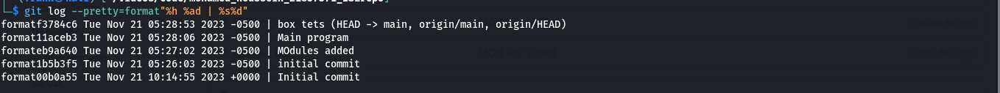
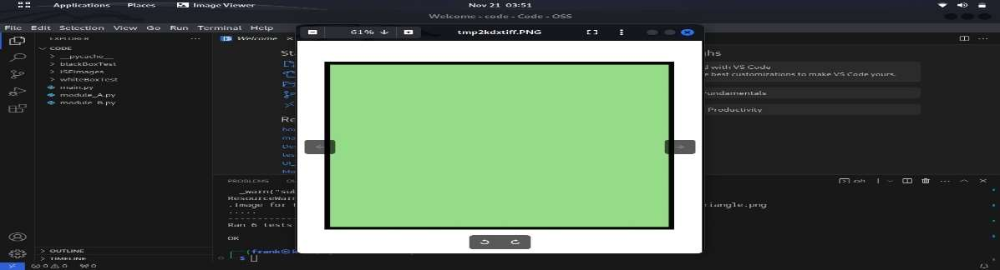
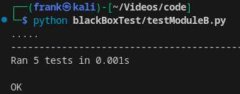
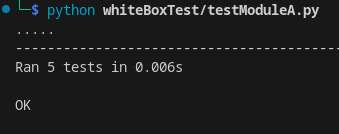

Introduction

Our goal in this project is to create an engaging software application
that helps kids understand fundamental mathematical ideas. The program
deals with two basic situations: the first is figuring out a regular
polygon\'s shape when its side count is known, and the second is
calculating a regular polygon\'s perimeter and area based on its side
length and side count. Scalability and maintainability are guaranteed in
our program by adhering to modularity rules and implementing efficient
version control procedures. We will go into the design philosophies,
implementation specifics, and testing techniques used to create this
teaching tool during this talk.

Version Control

Git was used for version control.

{width="9.648333333333333in"
height="1.365in"}The following are the git logs.

Modularity Design

Module A - This module identifies the shape of a regular polygon based
on the provided number of sides. It checks for validity, handles cases
of insufficient or excessive sides, and returns the polygon\'s name.
Optionally, it displays an image of the shape using graphics symbols
from the \"ISEimages\" folder.

Module B - This module computes the perimeter and area of a regular
polygon given the side length and the number of sides. It validates
input parameters, ensures a positive side length and a minimum of three
sides, and returns the calculated perimeter and area.

Module A Implementation

[Equivalence Partitioning:]{.underline}

• Valid Input:

> • Test the function with a valid number of sides (e.g., 4) and check
> if the correct shape name is returned.

• Invalid Input - Less Than 3 Sides:

> • Test the function with 2 sides and ensure it returns \"Invalid
> Number of Sides.\"

• Invalid Input - Greater Than 7 Sides:

> • Test the function with 8 sides and ensure it returns \"Number is too
> big.\"

• Display Image Option:

> • Test the function with a valid number of sides and the display image
> option set to true. Verify the image is

[Boundary Value Analysis:]{.underline}

• Boundary Condition - 3 Sides:

> • Test the function with 3 sides and ensure the correct shape name is
> returned.

• Boundary Condition - 7 Sides:

> • Test the function with 7 sides and ensure the correct shape name is
> returned.

Module B Implementation

• Equivalence Partitioning:

• Valid Input:

> • Test the function with a valid side length and number of sides.

• Invalid Side Length:

• Boundary Condition - Number of Sides = 3:

> • Test the function with.3 sides and ensure the correct perimeter

• Additional Scenarios:

• Random Values:

> • Test the function with a negative side length and ensure it • Test
> the function with random side lengths and numbers of

• Invalid Number of Sides: • Large Values:

> • Testrthe function with 2 sides and ensure it returns the • Test the
> function with large side lengths and numbers of sides

• Invalid Input Type:

> • Test the function with a non-numeric side length and ensure it

• Boundary Value Analysis:

• Boundary Condition - Side Length = 0:

• Design Decisions:

• The test cases cover a range of scenarios to.validate the

• Equivalence partitioning ensures that the software handles

> • Test the function with a side length of 0 and ensure it returns •
>
> •

Boundary valuetanalysistchecks the behavior of the software

Additional scenarios address random and extreme cases,

Test Implementations

• Black Box
#### Module A

{width="4.493332239720035in"
height="1.2166666666666666in"}

#### Module B

{width="3.986666666666667in"
height="1.1516666666666666in"}

• White Box
#### Module A

{width="2.9116655730533685in"
height="1.1516655730533683in"}
#### Module B

{width="3.986666666666667in"
height="1.1516655730533683in"}• White Box • White Box

> Summary Table of Work (Traceability Matrix)
| Module Name | Design of Test Cases | Test Code Implementation | Form of Input/Output | Data Type/s | Boundary Value Analysis (BVA) | Equivalence Partitioning (EP) | White-Box (WB) |
|-------------|-----------------------|---------------------------|----------------------|-------------|------------------------------|-------------------------------|----------------|
| Module A    | Done                  | Done                      | int                  | Parameter, Boolean | Yes                          | Yes                           | Yes            |
| Module B    | Done                  | Done                      | float, int           | Parameter          | Yes                          | Yes                           | Yes            |

> Challenges Faced

• During the development of this project, we encountered several
challenges: Graphics Integration:

• Challenge: Displaying images of polygon shapes based on user input
proved challenging due to

• Resolution: We addressed this challenge by carefully organizing the
image directory structure and

implemented for missing images. Floating-PointPrecision:

• Challenge: Floating-point precision issues arose during
white-boxtesting, leading to test failures

• assertAlmostEqual method, ensuring a morejflexible comparison of
floating-pointvalues with the

> Conclusion

To sum up, the initiative has produced a reliable and adaptable software
tool that helps kids understand fundamental mathematical ideas. The
implementation of modularity and version control concepts has made it
easier to have an organized development process. The software computes
with the appropriate precision and recognizes polygon shapes accurately.
Comprehensive black-box as well as white-box testing is implemented to
guarantee the software\'s correctness and dependability.

> Future Work

The following are potential future directions for the project\'s
extension: Additional Shapes:

> • Provide support for a wider variety of polygonal forms to enable a
> more varied educational experience.
>
> Enhanced Graphics:
>
> • In order to interest consumers, enhance the visual appeal by adding
> more eye-catching graphics and interactive features.
>
> Educational Features:
>
> • To improve the learning process, incorporate extra instructional
> elements like tutorials, interactive activities, and quizzes.

> Q&A

Your suggestions are much appreciated as we continue to develop this
instructional program.
